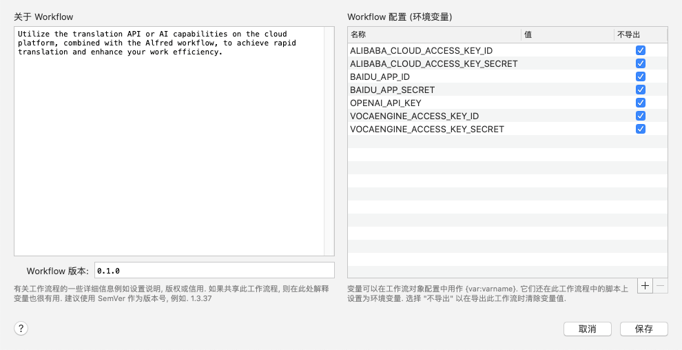

<h1 align="center">
  Translate Hub
</h1>

<div align="center">
Utilize the translation API or AI capabilities on the cloud platform, combined with the Alfred workflow, to achieve rapid translation and enhance your work efficiency.

[](https://github.com/antfu/eslint-config) [](https://github.com/sindresorhus/alfy)

</div>

**English** | [中文](./readme.zh-CN.md)

## Installation

You need[ Node.js 18+](https://nodejs.org/en) and [Alfred 4](https://www.alfredapp.com/) or later with the paid [Powerpack](https://www.alfredapp.com/powerpack/) upgrade.

### Install with NPM

```bash
npm install -g @mohaiyo/translate-hub
```

### Install with pnpm.

```bash
pnpm install -g @mohaiyo/translate-hub
```

### Manually

[download the workflow](https://github.com/mohaiyo/translate-hub/releases)

## Changelog

[Change Log](https://github.com/Mohaiyo/translate-hub/releases)

## Usage

### How to set up an API platform

Open Alfred and enter `trc use [openai]`. you can see the built-in platform and select the platform you want to use. the built-in platform is aliyun.

### How to set the target language

Open Alfred and enter `trc target [english]`. You can see the built-in target language options, select the target language you want to translate into, the built-in is English (en).

### How to use the translation function

Before using, set the API KEY for the platform you want to use. How to set, please see [Environment variables](#environment-variables)

Open Alfred and type `tr [enter the word or statement you want to translate]`. For example: tr 谁是世界上最可爱的人儿？

Press the `enter` key or the `cmd C` key to copy the translated text to the clipboard.

Press the `cmd L` key to display the translation in large text.

## Environment Variables

|              name               | value |                                 description                                  |
| :-----------------------------: | :---: | :--------------------------------------------------------------------------: |
|   ALIBABA_CLOUD_ACCESS_KEY_ID   |       |  If you use Alibaba Cloud Translation, set the corresponding ACCES KEY ID.   |
| ALIBABA_CLOUD_ACCESS_KEY_SECRET |       | If you use Alibaba Cloud Translation, set the corresponding ACCES KEY SECRET |
|         OPENAI_API_KEY          |       |             If you use OpenAI, set the corresponding OpenAi Key              |

environment variables screenshots




## Hotkey

If you download the workflow, you may have to manually set the hotkeys yourself.


## Screenshots


## Related

- [alfy](https://github.com/sindresorhus/alfy) - Create Alfred workflows with ease
