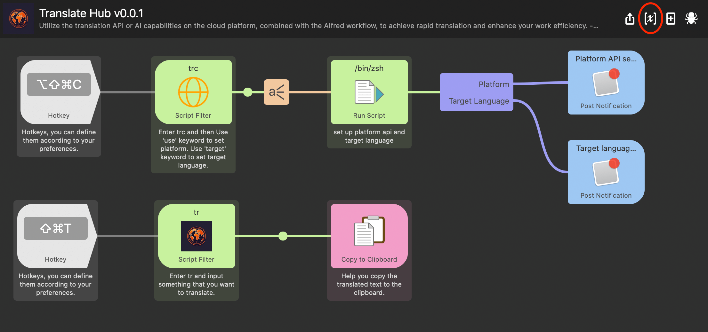
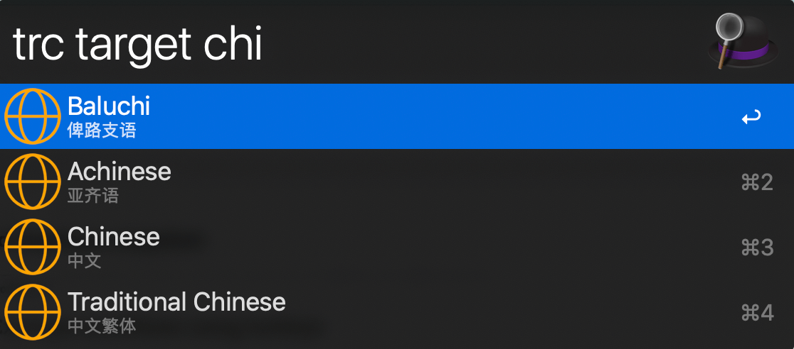
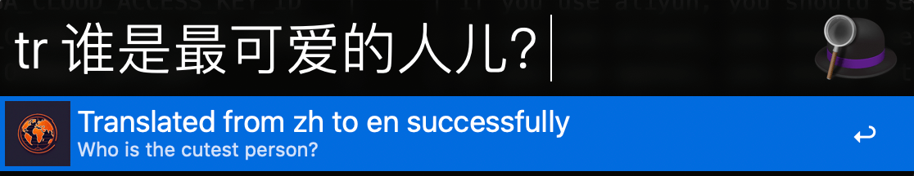

<h1 align="center">
Translate Hub
</h1>

<div align="center">

利用云平台上的翻译 API 或 AI 功能，结合 Alfred 工作流程，实现快速翻译，提升您的工作效率。

[](https://github.com/antfu/eslint-config) [](https://github.com/sindresorhus/alfy)

</div>

[English](./README.md) | **中文**

## 平台

|      平台       |      是否支持      | 说明                                                                                                                                                                                                                                         |
| :-------------: | :----------------: | :------------------------------------------------------------------------------------------------------------------------------------------------------------------------------------------------------------------------------------------- |
|   阿里云翻译    | :white_check_mark: | 机器翻译通用版每月的前 100 万字符免费，超出的部分会按照 50 元 / 百万字符收取费用；[官方文档](https://www.aliyun.com/product/ai/alimt),[定价](https://help.aliyun.com/zh/machine-translation/product-overview/pricing-of-machine-translation) |
|     OpenAI      | :white_check_mark: | [OpenAI API Key 创建](https://platform.openai.com/api-keys)                                                                                                                                                                                  |
| 微软 Azure 翻译 |        :x:         | 每月翻译 200 万字之内都是免费的，如果您每月超过 200 万字，我们会按照 10 美元 / 100 万字 的费率收费。[官方文档](https://learn.microsoft.com/zh-cn/azure/ai-services/translator/text-translation-overview)                                     |
|    百度翻译     | :white_check_mark: | 提供标准版、高级版、尊享版服务,完成身份认证，最高每月享 200 万免费字符量。[官方文档](https://fanyi-api.baidu.com/product/11)                                                                                                                 |
|    火山翻译     | :white_check_mark: | 火山翻译每月的前 200 万字符免费，超出的部分会按照 49 元 / 百万字符收取费用。[官方文档](https://www.volcengine.com/docs/4640/68515)                                                                                                           |

## 安装

你需要[ Node.js 18+](https://nodejs.org/en) 和 [Alfred 4](https://www.alfredapp.com/) 以上的版本 以及 [Powerpack](https://www.alfredapp.com/powerpack/).

### 使用 npm 安装

```bash
npm install -g @mohaiyo/translate-hub
```

### 使用 pnpm 安装

```bash
pnpm install -g @mohaiyo/translate-hub
```

### 手动安装

[下载工作流](https://github.com/Mohaiyo/translate-hub/releases)

## 变更日志

[变更日志](https://github.com/Mohaiyo/translate-hub/releases)

## 如何使用

### 如何设置 API 平台

打开 Alfred 并且输入`trc use [openai]`。可以看到内置的平台，选择你要使用的平台，内置的是 aliyun。

### 如何设置目标语言

打开 Alfred 并且输入`trc target [english]`。可以看到内置的目标语言选项，选择你要翻译成的目标语言，内置的是英语(en)。

### 如何使用翻译功能

使用前，请先设置你要使用的平台的对应的 API KEY。如何设置，请查看[设置环境变量](#设置环境变量)

打开 Alfred 并且输入`tr [输入你想要翻译的单词或者语句]`。例如: tr 谁是世界上最可爱的人儿？

按`enter`键或者`cmd+C`键复制翻译后的文本到剪贴板。

按`cmd+L`键以大文本显示翻译。

## 设置环境变量

|              name               | value |                     description                      |
| :-----------------------------: | :---: | :--------------------------------------------------: |
|   ALIBABA_CLOUD_ACCESS_KEY_ID   |       |   如果你使用阿里云翻译，请设置对应的 ACCESS KEY ID   |
| ALIBABA_CLOUD_ACCESS_KEY_SECRET |       | 如果你使用阿里云翻译，请设置对应的 ACCESS KEY SECRET |
|         OPENAI_API_KEY          |       |      如果你使用 OpenAI,请设置对应的 OpenAi Key       |
|    VOCAENGINE_ACCESS_KEY_ID     |       |    如果你使用火山翻译, 请设置对应的 ACCESS KEY ID    |
|  VOCAENGINE_ACCESS_KEY_SECRET   |       |  如果你使用火山翻译, 请设置对应的 ACCESS KEY SECRET  |
|          BAIDU_APP_ID           |       |       如果你使用百度翻译, 请设置对应的 APP ID        |
|        BAIDU_APP_SECRET         |       |     如果你使用百度翻译, 请设置对应的 APP SECRET      |

环境变量设置截图




## 热键

如果您下载工作流，则可能必须自己手动设置热键。


## 截图





## 常见问题

Q:为什么从内置的语言列表设置目标语言后，翻译却不成功？

> 内置的语言默认使用的是 aliyun 的支持语言，不同平台支持的翻译语言存在差异。

## 相关

- [alfy](https://github.com/sindresorhus/alfy) - 使用 alfy 快速创建一个 Alfred 工作流
